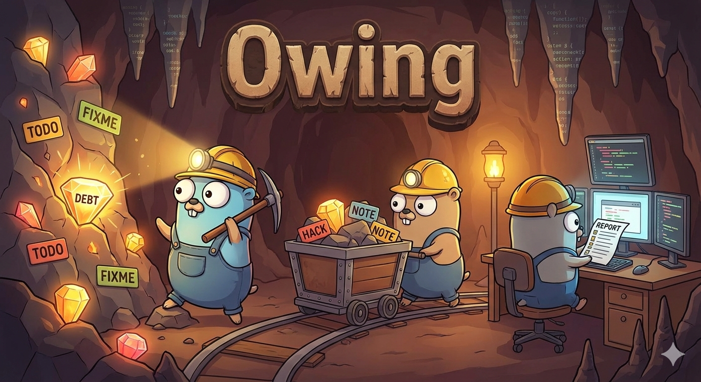
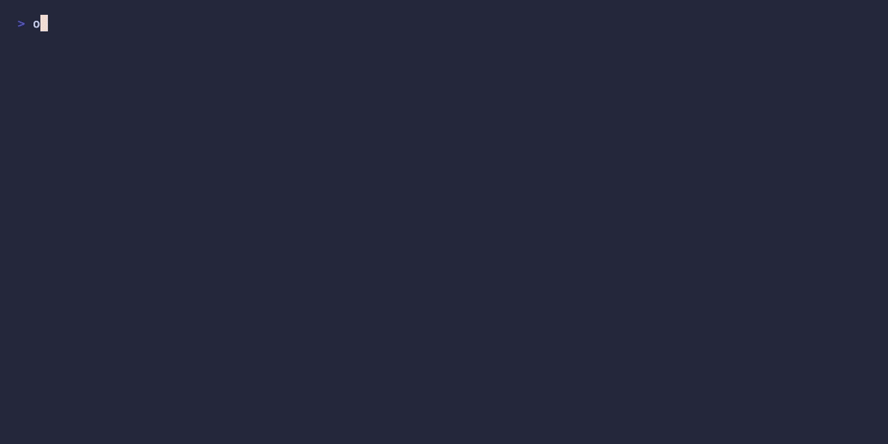

# Owing

 

[](https://pkg.go.dev/github.com/matteo-gildone/owing) 
[](https://goreportcard.com/report/github.com/matteo-gildone/owing) 
[](https://github.com/matteo-gildone/owing/releases) 
[](https://opensource.org/licenses/MIT)

> Track what you're owing your codebase

A CLI tool to find and report TODO, FIXME, HACK and NOTE comments in your source code.
Built with zero dependencies using only Go standard library.

## Features

- 🔍 Find TODO, FIXME, HACK and NOTE comments across your codebase
- 🚀 Fast directory scanning
- 📝 Clean, readable reports
- 🎯 zero external dependencies (stdlib only)

## Installation

```bash
go install github.com/matteo-gildone/owing@latest
```

## Usage

### Basic usage

```bash
# Scan current directory
owing .

# Scan specific directory
owing ./src
```


## Supported comment  formats

`owing` recognizes comments in most programming languages:

```
// TODO: your message
// FIXME: your message
// HACK: your message
// NOTE: your message

/* TODO: your message */
# TODO: your message
-- TODO: your message
```

--- 

## Acknowledgments 

Mining for technical debt is hard work!  

**Logo & Illustrations**: Created with the help of Gemini, inspired by the "Mining for Debt" concept. 

**The Gopher**: Our favorite mascot was originally designed by the amazing [Renée French](http://reneefrench.blogspot.com/) 
and is used under the Creative Commons 4.0 Attribution license.
